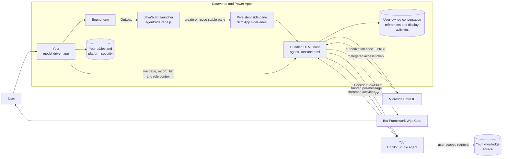
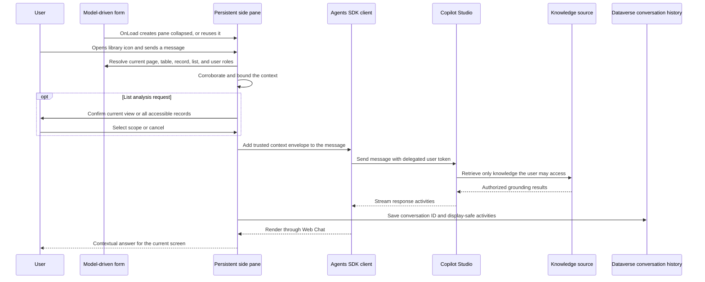

# Agent Sidecar for Model-Driven Apps

Agent Sidecar brings published Copilot Studio agents into Dataverse model-driven apps as persistent, context-aware assistants. Users stay inside the business application they already know while the agent receives the current page, table, record, list, and user-role context needed to provide relevant help.

The core capability is delivered as one importable Power Platform solution. A System Administrator configures it through the included administration Code App, chooses where each assistant belongs, and manages its lifecycle without writing form scripts or building a custom host.

## Why Agent Sidecar

Model-driven apps contain the records and processes where work happens, while Copilot Studio agents provide guidance, knowledge, and action. Agent Sidecar connects those experiences without creating another destination for users to visit.

- **Help appears in the flow of work.** A branded, collapsible side pane initializes from an enabled form and stays available as users move through supported forms and lists.
- **Every prompt carries current context.** The agent can distinguish a record from a list, understand split-view layouts, and tailor guidance using the signed-in user's Dataverse role names.
- **Identity and permissions remain authoritative.** Delegated Microsoft Entra authentication means the agent operates as the signed-in user and remains subject to that user's existing access.
- **Administrators control placement and lifecycle.** The administration app discovers available apps, forms, and published agents, then deploys and verifies the configuration through guided operations.
- **Conversations remain useful over time.** Users can resume or delete their own saved conversations without mixing transcripts between assistants.

## Product capabilities

### Context-aware assistance inside model-driven apps

- The sidecar opens as a persistent, collapsed pane on the main forms selected by an administrator.
- Immediately before each user prompt or explicit new-conversation action, the runtime resolves the live page type, table, record ID, record name, app ID, and signed-in user's Dataverse security-role names.
- Navigation updates context locally but does not contact the agent. The agent acts only after an explicit user action.
- In model-driven split view, a matching visible record form takes precedence over the adjacent list. A standalone list remains list context.
- Record names are accepted only when the table and normalized record ID match, preventing a name from the previously viewed record from leaking into the next prompt.
- When the user reaches a table that is not enabled for the configuration, the side-pane rail collapses without deleting the pane or its conversation state.
- Role names help the agent adjust tone and guidance; they never grant access or replace Dataverse authorization.
- The accessible, Messages-inspired chat experience presents clear user and assistant turns, connection status, sign-in, recent-conversation, and delete controls within the pane.
- A selected main form must initialize the sidecar before it can continue into a list; opening the app directly on a list does not initialize the pane.

### Multiple independent assistants in one app

- A model-driven app can host up to **10 enabled sidecars**.
- Each sidecar is identified by its immutable configuration GUID rather than by app ID, so multiple assistants can target the same app and even the same form.
- Agent connection, authentication, active conversation, recent history, consent handling, blocked prompts, and dialog state remain local to each pane.
- Overlapping form bindings share one reference-counted dispatcher, allowing one sidecar to be disabled, edited, or removed without interrupting another sidecar that uses the same form.
- Invalid or colliding configurations are quarantined independently instead of preventing valid sidecars from loading.

### Durable, user-owned conversations

- The runtime captures the real Microsoft 365 Agents SDK conversation ID and stores display-safe user and assistant activities in Dataverse.
- **Recent conversations** resumes the agent's server-side context and replays the corresponding local transcript.
- Conversation history is scoped by signed-in owner, sidecar configuration, model-driven app, and agent schema, preventing cross-user and cross-pane mixing.
- Greeting-only sessions remain out of **Recent conversations** until the user sends a message.
- Resuming a conversation on a different record produces an orientation warning rather than silently treating the old record as current.
- Users can permanently delete a saved conversation and its activities after confirmation. Deleting the active conversation immediately starts a clean session.

### Explicit scope for list analysis

- On a supported list, requests to analyze or process records pause before the prompt is sent.
- The user chooses **Current view (all matching rows)** or **All accessible records** and sees a warning about potentially large result sets.
- Current-view analysis includes the bounded view definition and identifies it as untrusted query data, not agent instructions.
- All-record analysis preserves Dataverse security and does not silently inherit the current view's filter.
- Canceling the scope dialog cancels the prompt. No list details are sent without the user's confirmed choice.

### Delegated identity and controlled consent

- The browser uses Microsoft Entra authorization code flow with PKCE and requests only the delegated `CopilotStudio.Copilots.Invoke` scope.
- No client secret is created, shipped, or stored in the browser.
- Standard Copilot Studio and GitHub Copilot harness agents use their supported Agents SDK endpoints.
- Silent sign-in is attempted when possible, with an explicit **Sign in** action when interaction is required.
- Repeated submission of the same connector-consent decision is deduplicated.
- Distinct MCP write-consent requests remain distinct and are never automatically approved.

### Guided administration

- The **Sidecar Dashboard** gives administrators a portfolio view of configured assistants, deployment state, health, target app, and enabled tables.
- Each dashboard card displays the validated agent, uploaded, or packaged default icon configured for that pane, matching the icon users see in the model-driven app.
- The creation wizard presents model-driven apps in a readable table, defaults each selected table to its **Information** main form, and allows exact per-form selection.
- Published Copilot Studio agents are discovered from the current environment. The app infers standard versus GitHub Copilot harness, generates the cloud-aware endpoint, and revalidates the selected agent before deployment.
- Tenant ID and Dataverse organization URL are inferred from the signed-in Power Apps host when available; tenant ID remains editable.
- Administrators can use the selected agent's icon, upload a validated PNG or JPEG, or retain the packaged default icon.
- Pane title and width are configurable during setup, with the title defaulted from the selected application.
- A progressive review experience keeps current choices in the main workflow, and checkmarks distinguish completed setup steps and confirmed operation accomplishments from pending work.

### Safe lifecycle management

- **Health validation** checks the live form bindings and reports healthy, warning, or critical states.
- **Drift review** requires explicit administrator approval before reconciliation changes live metadata.
- Placement and appearance can be edited in place without changing configuration identity, pane identity, target app, agent connection, Entra identity, binding solution, or conversation history.
- The settings editor uses a focused table-and-form workspace and explains placement updates, publishing, verification, and rollback while a save is running.
- Edits rediscover the app's current forms, expose unavailable selections, require at least one available form, and reject stale or concurrent changes.
- New form ownership is added before old ownership is removed. Configuration-owned replacement icons are published and verified before the previous icon is deleted.
- Deployment and editing include read-back verification and compensating rollback that leaves unrelated form XML untouched.
- Administrators can disable and re-enable a sidecar without deleting its configuration, reconcile approved drift, or uninstall only the selected sidecar.

## Get started

Everything below is done through **solution import** and the **administration app** — no command line required.

### 1. Open the interactive setup guide

[docs/setup-guide/AgentSidecarSetupGuide.html](docs/setup-guide/AgentSidecarSetupGuide.html) is a complete, click-by-click walkthrough with a live worksheet that fills your own IDs into every step (each with a one-click **Copy** button). Open it in a browser and keep it beside these steps — double-click the file, or use `open docs/setup-guide/AgentSidecarSetupGuide.html` (macOS) / `start docs\setup-guide\AgentSidecarSetupGuide.html` (Windows).

### 2. Prepare the prerequisites

- A Power Platform environment with Dataverse where you are a **System Administrator**.
- A **published Copilot Studio agent** in that environment. The administration app discovers published agents in its current environment and generates the supported standard or GitHub Copilot harness endpoint automatically.
- A **Microsoft Entra app registration** for the side pane's browser sign-in. Follow the dedicated [Entra app registration guide (PDF)](docs/user-guides/HR-Management-App-Guide-Entra-App-Registration.pdf) ([Word](docs/user-guides/HR-Management-App-Guide-Entra-App-Registration.docx)). In short: single-tenant **SPA**, redirect URI `https://<your-org>.crm.dynamics.com/WebResources/maftagsc_/copilot/authRedirect.html`, delegated **Power Platform API** permission `CopilotStudio.Copilots.Invoke` with **admin consent**, and **no client secret**.

### 3. Import the solution

Import **[solution-core/AgentSidecarCore.zip](solution-core/AgentSidecarCore.zip)** into your environment (Power Platform admin center, or make.powerapps.com → **Solutions → Import**). It brings the sidecar tables, web resources, and the **Agent Sidecar administration app** itself. Map any prompted connections during import.

### 4. Configure and deploy in the app

Open the **Agent Sidecar** app and run the wizard:

1. **Application** — pick the model-driven app to add the sidecar to.
2. **Tables & forms** — choose the tables; expand any table to select specific forms (the **Information** form is selected by default, others are optional).
3. **Agent** — select a published agent from the current environment. The administration app infers the environment ID, classifies the standard or GitHub Copilot harness, and generates and validates the Agents SDK endpoint. Then choose the Copilot Studio agent logo, upload a custom PNG/JPEG, or keep the default icon. Custom uploads should be square (128×128 or 256×256 recommended), no larger than 512×512 or 256 KB. SVG uploads are not accepted.
4. **Identity** — enter the SPA app registration's **client ID**. The **tenant ID** is inferred from the signed-in Power Apps host and remains editable for correction.
5. **Review & Deploy** — deploy. The app adds the sidecar to the selected forms, publishes, and verifies the result.

Completed setup steps and successful lifecycle operations display checkmarks so administrators can distinguish confirmed accomplishments from pending work at a glance.

After deployment, the overview groups information by purpose and keeps each action beside the content it changes. **Placement** lists every enabled table and form and opens a compact master-detail editor: select a table in the navigator, then choose only that table's forms in the focused workspace. **Appearance** previews the configured icon and opens directly to a dedicated appearance tab. **Health validation** and **Availability** own their respective actions. In-place edits preserve configuration and pane IDs, app and agent connections, Entra identity, binding solution, and conversation history. While an update runs, the editor explains the binding, publish, and live-verification stages and confirms completed work with checkmarks. The administration app refreshes the app's current forms, requires at least one selection, applies additions before removals, publishes and reads back the result, and rejects a save if another administrator changed the sidecar after the editor opened.

### 5. Use it

Open a configured form in your app. The sidecar appears as its configured collapsed icon; expand it, sign in when prompted, and ask a question about the current record. The pane preserves the conversation as the user navigates, resolves the latest supported context for each prompt, and collapses on unsupported tables.

## Reference implementation: HR Management (optional)

If you don't have a model-driven app to try this on, deploy the included **HR Management** reference. It is a complete example app — a Dataverse HR schema for benefits, time off, and expenses; seven supported form surfaces; a **HR Mgmt Classic** Copilot Studio agent; and a full knowledge library — that shows one sidecar working across a business application. It is a demonstration, not a requirement for using the sidecar with your own app.

- Reference solution source: [solution](solution) (`HRAgentSidecar`)
- Knowledge library: [docs/entity-help](docs/entity-help) and [docs/user-guides](docs/user-guides)
- Data model and planning: [dataverse](dataverse), [CONTEXT.md](CONTEXT.md)

## Architecture

### Runtime message flow

## How the components fit together

| Component | Responsibility |
|---|---|
| **Your model-driven app** | Provides the navigation shell, Dataverse forms, authenticated Power Platform session, and current page context. Your existing app is used as-is — nothing is recreated. |
| **Form OnLoad handler** | The administration app registers a handler on each form you select, so the pane loads with that form. |
| **JavaScript launcher** | Resolves every valid enabled configuration bound to the current form, orders them by pane title then configuration ID, and creates or reuses each configuration-keyed pane. It shares form dispatchers safely and quarantines malformed or colliding records independently. |
| **Persistent side pane** | Keyed by immutable configuration GUID, it starts collapsed and preserves only its own active conversation, consent state, and dialogs as the user navigates. Unsupported tables collapse the pane rail without destroying that state. |
| **HTML host and client** | Hosts Web Chat, signs the user in, creates or resumes the Agents SDK connection, resolves record or list context for each explicit prompt, persists display-safe activities, replays selected transcripts, and deduplicates repeated decisions for the same connector-consent request. |
| **Conversation tables** | User-owned `maftagsc_sidecarconversation` and `maftagsc_sidecaractivity` rows provide recent-conversation discovery and transcript replay without storing tokens, trusted context envelopes, or connector payloads. |
| **Microsoft Entra app registration** | Authenticates the signed-in user with authorization code + PKCE and requests only `https://api.powerplatform.com/CopilotStudio.Copilots.Invoke`. No browser client secret exists. |
| **Microsoft 365 Agents SDK** | `CopilotStudioClient` uses the Web app channel connection string as its direct endpoint with the delegated user token. |
| **Your Copilot Studio agent** | Interprets the question and uses the supplied screen context to select relevant guidance from its knowledge. |
| **Agent Sidecar Core solution** | Packages the sidecar tables, web resources, and the administration app. Import it to bring the whole capability into an environment. |
| **Administration app** | The System Administrator experience for discovering apps and published agents, deploying sidecars, editing placement and appearance, validating health, reconciling approved drift, disabling or re-enabling configurations, and uninstalling a selected sidecar. Built as a Power Apps Code App and shipped inside the Core solution. |

### Multiple-sidecar design principles

- Configuration GUID is identity; app ID is only a grouping key.
- Pane IDs are derived as `maftagsc_sidecar_<configuration-guid-without-dashes>`; no pane/order columns are required.
- Overlapping form bindings are supported through one reference-counted shared form dispatcher.
- Every iframe resolves its exact configuration ID and verifies both app ID and pane ID.
- Authentication request storage and popup names are configuration/nonce scoped. Agent connections, conversations, history, delete state, list dialogs, and consent trackers stay pane-local.
- Navigation updates local context only. Distinct MCP consent requests are never auto-approved, and no administrative-consent bypass exists.
- Direct-list-first startup remains out of scope; list analysis still begins from the explicit in-pane user flow.

## Context synchronization

The pane is deliberately long-lived. Navigating to another form does not destroy and recreate it, because doing so would lose the conversation. Instead, the launcher writes the authoritative form context locally on every navigation and the pane reads it immediately before each user message or explicit new-conversation action. In a split view, the runtime corroborates that stored context against the visible form's table, record, and form identifiers before allowing it to take precedence over the adjacent list. Navigation by itself sends nothing to the agent.

The context includes:

| Value | Source | Use |
|---|---|---|
| `pageType` | Host page context | Distinguishes record, list, and other supported pages. |
| `entityName` | Current form context | Routes the request to the matching screen. |
| `recordId` | Current form context | Identifies the current record without treating the identifier as knowledge. |
| `recordName` | Matching form primary attribute | Gives the user a friendly orientation after table and record ID are verified. |
| `appId` | Current app properties | Confirms the model-driven app context when available. |
| `roles` | Signed-in user's Dataverse role collection | Helps the agent tailor tone and guidance; never grants access. |
| List view identity | Host page context | Identifies the current saved or personal view when available. |
| Confirmed list scope | Explicit in-pane user choice | Adds either a bounded current-view FetchXML definition or an all-accessible-records instruction to that request only. |

A trusted, bounded context envelope accompanies every outbound user message. Context is part of the real user activity rather than a separate event, so the agent receives one input and produces one conversational turn.

The primary record name is accepted only when the form's table and normalized record ID match the current page context, so a record name from the previously viewed screen never leaks into the next question.

When list and record surfaces are visible together, the pane uses record context only if the stored launcher context and the visible form agree on table, normalized record ID, and form ID. This protects the selected record experience in split view without reviving stale record context on a true list.

Selecting **New conversation** closes the current Agents SDK connection, clears the visible transcript, resolves the page open at that moment, and creates a fresh conversation without forcing another sign-in. The previous conversation remains available under **Recent conversations**. Selecting a recent conversation recreates the connection with its saved Agents SDK `conversationId` and replays its stored display activities; it does not send page context until the user submits another prompt.

Selecting a saved conversation also enables **Delete**. After confirmation, the sidecar permanently deletes that user-owned conversation and its saved activities. Deleting the active conversation immediately opens a clean session; deletion cannot be undone.

**Recent conversations** includes only sessions where the user sent at least one message. Agent greetings and other assistant-only startup messages may be stored briefly for the active connection, but they are excluded from the selector.

## Authentication and authorization

The side pane preserves the user's identity end to end:

1. The browser signs the user in through Microsoft Entra ID.
2. It requests only the delegated Copilot Studio invoke scope.
3. `CopilotStudioClient` sends the delegated token to Copilot Studio.
4. The agent accesses its knowledge as that user, so the user's existing permissions remain authoritative.
5. Any live Dataverse reads remain subject to table, row, and field security.
6. Dataverse security-role names may shape the response but do not expand the user's permissions.

Access tokens are handled by MSAL and are not written to URLs, logs, source files, or solution configuration. Application ID, tenant ID, environment ID, and agent schema name are identifiers, not secrets.

Conversation history follows Dataverse security. Assign the packaged **Agent Sidecar User** security role alongside each end user's normal application role. Conversation and activity tables are user-owned, and the runtime explicitly filters recent conversations to the signed-in owner even when the caller has broader administrative access. Only bounded, user-visible message text is stored; access tokens, trusted context envelopes, full `channelData`, and connector payloads are never persisted.

### Microsoft Entra app registration

The side pane cannot reach the Copilot Studio agent until its browser application is registered correctly. Use the dedicated guide rather than a generic app-registration walkthrough:

- [Published PDF guide](docs/user-guides/HR-Management-App-Guide-Entra-App-Registration.pdf)
- [Editable Word guide](docs/user-guides/HR-Management-App-Guide-Entra-App-Registration.docx)

The guide covers the settings that make the delegated Agents SDK connection work:

1. Register the browser client as a single-tenant **Single-page application (SPA)**.
2. Add the exact redirect URI: `https://<your-org>.crm.dynamics.com/WebResources/maftagsc_/copilot/authRedirect.html`.
3. Add the delegated **Power Platform API** permission `CopilotStudio.Copilots.Invoke`.
4. Grant tenant admin consent for that delegated permission.
5. Copy the non-secret Application ID and tenant ID into the wizard's Identity step.
6. Leave **Certificates & secrets** empty — the browser uses authorization code with PKCE and must never receive a client secret.

The guide also includes a configuration worksheet, validation checklist, and troubleshooting for redirect URI, consent, and agent-connection failures.

## Architecture decisions

- [Separate model-driven solution](docs/adr/0001-use-separate-model-driven-hr-solution.md)
- [Delegated authentication and Microsoft 365 Agents SDK](docs/adr/0003-use-delegated-agents-sdk-for-authenticated-side-pane.md)
- [Reusable core and target binding product architecture](docs/adr/0004-productize-sidecar-as-core-and-target-bindings.md)
- [Code App administration architecture](docs/adr/0005-use-code-app-for-sidecar-administration.md)
- [Multiple independently configured sidecars per app](docs/adr/0007-support-multiple-sidecars-per-app.md)

## Reference data model (HR Management)

The HR Management reference prefers out-of-the-box Dataverse capabilities before introducing custom schema.

**Reused platform tables** — Employee → `systemuser`, Position → `position`, Department → `businessunit`, plus platform ownership, currency, state/status, and audit columns.

**Custom tables** — Benefit Plan, Benefit Enrollment, Time Off Type, Time Off Balance, Time Off Request, Expense Report, and Expense Line.

The planning source is [dataverse/planning-payload.json](dataverse/planning-payload.json), the reuse analysis is [dataverse/hr-oob-discovery.md](dataverse/hr-oob-discovery.md), and business terminology is in [CONTEXT.md](CONTEXT.md).

## Knowledge and help content (reference)

The HR Management reference ships a full knowledge library that shows how to ground the agent:

- [docs/entity-help](docs/entity-help) — screen-specific help for each business entity, as agent-ready Markdown, editable Word, and published PDF.
- [docs/user-guides](docs/user-guides) — end-to-end process guidance for employee and organization data, time off, expenses, and benefits.

[docs/entity-help/entity-help-manifest.json](docs/entity-help/entity-help-manifest.json) maps a Dataverse table name to the matching topic; the current page's `entityName` is the routing key. Your own agent's knowledge and any SharePoint or Copilot Studio knowledge sources are configured in your environment, not in this solution.

## Repository map

| Path | Contents |
|---|---|
| [solution-core/AgentSidecarCore.zip](solution-core/AgentSidecarCore.zip) | The importable Agent Sidecar Core solution — the capability you deploy. |
| [docs/setup-guide](docs/setup-guide) | Interactive, click-by-click setup guide with a values worksheet. |
| [docs/user-guides](docs/user-guides) | Microsoft Entra app-registration guide and reference process guides. |
| [docs/adr](docs/adr) | Architecture Decision Records. |
| [src](src) | Source for the Agent Sidecar administration app (Power Apps Code App). |
| [model-driven](model-driven) | Source for the side-pane runtime web resources. |
| [solution](solution) | HR Management reference solution source (`HRAgentSidecar`). |
| [dataverse](dataverse) | Reference data model, planning payload, and discovery notes. |

## Building from source

Using the sidecar needs nothing beyond the setup steps above. Contributors who want to modify the administration app or the side-pane runtime will find build and test notes in [model-driven/README.md](model-driven/README.md) and [HANDOFF.md](HANDOFF.md).

## Design principles

- One stable pane per Sidecar Configuration, so same-app sidecars remain independent without creating duplicate conversations.
- Persist only display-safe conversation history in user-owned Dataverse rows and resume only conversation IDs captured from real SDK connections.
- Capture context locally on every navigation and deliver the latest value only with a user prompt or explicit new conversation.
- Treat record IDs as pointers, never as authorization or knowledge content.
- Preserve delegated identity end to end; the agent answers as the signed-in user and stays within their permissions.
- Never include unrelated business data, tokens, or connector payloads in prompts or logs.
- Deploy, update, and remove sidecars through the administration app so form changes are always published and verified.
